# Complete Guide to Categorical Data Encoding in Machine Learning


A comprehensive guide to understanding and implementing categorical data encoding techniques in machine learning projects.

## 📋 Table of Contents

1. [Why Do We Need Encoding?](#-why-do-we-need-encoding)
2. [Label Encoding](#-label-encoding)
3. [One-Hot Encoding](#-one-hot-encoding)
4. [Ordinal Encoding](#-ordinal-encoding)
5. [When to Use Which Method](#-when-to-use-which-method)
6. [Common Pitfalls and Best Practices](#-common-pitfalls-and-best-practices)
7. [Scikit-learn's Automatic Handling](#-scikit-learns-automatic-handling)
8. [Practical Examples](#-practical-examples)
9. [Advanced Techniques](#-advanced-techniques)
10. [Quick Reference](#-quick-reference-cheat-sheet)

---

## 🤔 Why Do We Need Encoding?

Machine learning algorithms work with **numbers**, not text or categories. When your data contains categorical information like:

- Colors: `["red", "green", "blue"]`
- Sizes: `["small", "medium", "large"]` 
- Species: `["setosa", "versicolor", "virginica"]`

You need to convert these into numerical format before training your model.

```python
# This won't work directly with ML models
data = ["red", "green", "blue", "red"]

# This will work
encoded_data = [2, 1, 0, 2]
```

---

## 🏷️ Label Encoding

### What is Label Encoding?

**Label Encoding** assigns a unique integer to each category. It's the simplest form of encoding.

```python
from sklearn.preprocessing import LabelEncoder
import numpy as np

# Initialize the encoder
label_encoder = LabelEncoder()

# Original categorical data
categories = ["apple", "banana", "cherry", "apple", "banana"]

# Encode the categories
encoded = label_encoder.fit_transform(categories)
print("Original:", categories)
print("Encoded: ", encoded)
print("Mapping: ", dict(zip(label_encoder.classes_, range(len(label_encoder.classes_)))))
```

**Output:**
```
Original: ['apple', 'banana', 'cherry', 'apple', 'banana']
Encoded:  [0 1 2 0 1]
Mapping:  {'apple': 0, 'banana': 1, 'cherry': 2}
```

### ✅ When to Use Label Encoding

**Perfect for TARGET VARIABLES (y) in classification:**

```python
from sklearn.datasets import load_iris
from sklearn.preprocessing import LabelEncoder

# Load iris dataset
iris = load_iris()
target_names = iris.target_names[iris.target]  # Convert to string labels

print("Original targets:", target_names[:10])

# Encode target labels
label_encoder = LabelEncoder()
y_encoded = label_encoder.fit_transform(target_names)
print("Encoded targets: ", y_encoded[:10])
```

**Output:**
```
Original targets: ['setosa' 'setosa' 'setosa' 'setosa' 'setosa' 'setosa' 'setosa' 'setosa' 'setosa' 'setosa']
Encoded targets:  [0 0 0 0 0 0 0 0 0 0]
```

### ❌ Problems with Label Encoding for Features

**Never use Label Encoding for categorical FEATURES unless they have natural order:**

```python
# BAD EXAMPLE - Don't do this!
colors = ["red", "green", "blue", "red", "green"]
encoder = LabelEncoder()
encoded_colors = encoder.fit_transform(colors)
print("Problematic encoding:", encoded_colors)
# Output: [2 1 0 2 1] - Model thinks red(2) > green(1) > blue(0)
```

**Why this is problematic:**
- The model assumes `red (2) > green (1) > blue (0)`
- Creates false mathematical relationships
- Can lead to poor model performance

---

## 🔥 One-Hot Encoding

### What is One-Hot Encoding?

**One-Hot Encoding** creates binary columns for each category, with 1 indicating presence and 0 indicating absence.

```python
from sklearn.preprocessing import OneHotEncoder
import pandas as pd

# Original data
colors = ["red", "green", "blue", "red", "green"]
colors_array = np.array(colors).reshape(-1, 1)

# One-hot encode
encoder = OneHotEncoder(sparse_output=False)
encoded = encoder.fit_transform(colors_array)

# Create a readable DataFrame
feature_names = encoder.get_feature_names_out(['color'])
df_encoded = pd.DataFrame(encoded, columns=feature_names)
df_encoded['original'] = colors

print(df_encoded)
```

**Output:**
```
   color_blue  color_green  color_red original
0         0.0          0.0        1.0      red
1         0.0          1.0        0.0    green
2         1.0          0.0        0.0     blue
3         0.0          0.0        1.0      red
4         0.0          1.0        0.0    green
```

### ✅ Advantages of One-Hot Encoding

- **No false ordinal relationships**
- **Works with all ML algorithms**
- **Mathematically sound**
- **Easy to interpret**

### ❌ Disadvantages

- **High dimensionality** with many categories
- **Sparse matrices** (mostly zeros)
- **Memory intensive** for large datasets

### Practical Example with Real Data

```python
import pandas as pd
from sklearn.preprocessing import OneHotEncoder
from sklearn.compose import ColumnTransformer
from sklearn.linear_model import LogisticRegression
from sklearn.model_selection import train_test_split

# Create sample dataset
data = {
    'age': [25, 30, 35, 28, 45],
    'color_preference': ['red', 'blue', 'green', 'red', 'blue'],
    'size_preference': ['small', 'large', 'medium', 'small', 'large'],
    'purchased': [1, 0, 1, 1, 0]
}

df = pd.DataFrame(data)
print("Original DataFrame:")
print(df)

# Separate features and target
X = df[['age', 'color_preference', 'size_preference']]
y = df['purchased']

# Create preprocessor for categorical columns
preprocessor = ColumnTransformer(
    transformers=[
        ('cat', OneHotEncoder(drop='first'), ['color_preference', 'size_preference']),
        ('num', 'passthrough', ['age'])
    ])

# Transform the data
X_encoded = preprocessor.fit_transform(X)
print(f"\nShape before encoding: {X.shape}")
print(f"Shape after encoding: {X_encoded.shape}")

# Get feature names
feature_names = preprocessor.get_feature_names_out()
print(f"Feature names: {feature_names}")
```

---

## 📊 Ordinal Encoding

### What is Ordinal Encoding?

**Ordinal Encoding** is used when categories have a **natural order** or hierarchy.

```python
from sklearn.preprocessing import OrdinalEncoder

# Data with natural order
education_levels = ["High School", "Bachelor's", "Master's", "PhD", "Bachelor's", "High School"]
education_array = np.array(education_levels).reshape(-1, 1)

# Define the order explicitly
categories = [["High School", "Bachelor's", "Master's", "PhD"]]
encoder = OrdinalEncoder(categories=categories)

encoded = encoder.fit_transform(education_array)
print("Original:", education_levels)
print("Encoded: ", encoded.flatten())
```

**Output:**
```
Original: ["High School", "Bachelor's", "Master's", "PhD", "Bachelor's", "High School"]
Encoded:  [0. 1. 2. 3. 1. 0.]
```

### ✅ When to Use Ordinal Encoding

**Perfect for ordered categorical data:**

```python
# Examples of ordinal data
examples = {
    'education': ['High School', "Bachelor's", "Master's", 'PhD'],
    'satisfaction': ['Poor', 'Fair', 'Good', 'Excellent'],
    'income_bracket': ['Low', 'Medium', 'High'],
    'clothing_size': ['XS', 'S', 'M', 'L', 'XL', 'XXL']
}

for category, values in examples.items():
    encoder = OrdinalEncoder(categories=[values])
    encoded = encoder.fit_transform(np.array(values).reshape(-1, 1))
    print(f"{category}: {values} → {encoded.flatten()}")
```

---

## 🎯 When to Use Which Method

| Encoding Type | Best For | Example Categories | Pros | Cons |
|--------------|----------|-------------------|------|------|
| **Label Encoding** | Target variables (y) only | Species, Classes, Labels | Simple, Memory efficient | Creates false order for features |
| **One-Hot Encoding** | Nominal categorical features | Colors, Countries, Brands | No false relationships, Works everywhere | High dimensionality, Sparse |
| **Ordinal Encoding** | Ordered categorical features | Education, Ratings, Sizes | Preserves order, Compact | Only for ordered data |

### Decision Tree

```mermaid
graph TD
    A[Categorical Data] --> B{Is it Target Variable?}
    B -->|Yes| C[Label Encoding ✅]
    B -->|No| D{Does it have natural order?}
    D -->|Yes| E[Ordinal Encoding ✅]
    D -->|No| F{How many categories?}
    F -->|Few < 10| G[One-Hot Encoding ✅]
    F -->|Many > 10| H[Consider Target/Binary Encoding]
```



---

## ⚠️ Common Pitfalls and Best Practices

### ❌ Common Mistakes

1. **Using Label Encoding for Non-Ordered Features**
```python
# DON'T DO THIS
cities = ['New York', 'London', 'Tokyo', 'Paris']
encoder = LabelEncoder()
encoded_cities = encoder.fit_transform(cities)  # Creates false order!
```

2. **Forgetting to Handle Unknown Categories**
```python
# Training data
train_colors = ['red', 'blue', 'green']
encoder = OneHotEncoder()
encoder.fit(np.array(train_colors).reshape(-1, 1))

# Test data with new category
test_colors = ['red', 'yellow']  # 'yellow' wasn't in training!
# This will cause an error
```

3. **Not Saving the Encoder**
```python
# BAD: You lose the encoding mapping
encoded_data = OneHotEncoder().fit_transform(data)

# GOOD: Save for later use
encoder = OneHotEncoder()
encoded_data = encoder.fit_transform(data)
# Save encoder for future use on test data
```

### ✅ Best Practices

1. **Handle Unknown Categories Gracefully**
```python
# Use handle_unknown parameter
encoder = OneHotEncoder(handle_unknown='ignore', sparse_output=False)
encoder.fit(train_data)
encoded_test = encoder.transform(test_data)  # Won't crash on new categories
```

2. **Use Pipelines for Preprocessing**
```python
from sklearn.pipeline import Pipeline
from sklearn.compose import ColumnTransformer

# Create preprocessing pipeline
preprocessor = ColumnTransformer([
    ('cat', OneHotEncoder(handle_unknown='ignore'), categorical_features),
    ('num', StandardScaler(), numerical_features)
])

# Create full pipeline
pipeline = Pipeline([
    ('preprocessor', preprocessor),
    ('classifier', LogisticRegression())
])

pipeline.fit(X_train, y_train)
```

3. **Drop First Column to Avoid Multicollinearity**
```python
# Use drop='first' to avoid dummy variable trap
encoder = OneHotEncoder(drop='first', sparse_output=False)
```

---

## 🤖 Scikit-learn's Automatic Handling

### What Scikit-learn Handles Automatically

```python
from sklearn.linear_model import LogisticRegression
from sklearn.datasets import load_iris

# Load iris dataset
iris = load_iris()
X, y = iris.data, iris.target_names[iris.target]  # String labels

print("Target labels (strings):", y[:5])

# Scikit-learn automatically encodes string targets
model = LogisticRegression()
model.fit(X, y)  # This works! No manual encoding needed for y

print("Classes found by model:", model.classes_)
```

**Output:**
```
Target labels (strings): ['setosa' 'setosa' 'setosa' 'setosa' 'setosa']
Classes found by model: ['setosa' 'versicolor' 'virginica']
```

### What You Still Need to Encode Manually

```python
# Categorical FEATURES still need manual encoding
data_with_categories = pd.DataFrame({
    'age': [25, 30, 35],
    'color': ['red', 'blue', 'green'],  # This needs encoding!
    'purchased': ['yes', 'no', 'yes']   # Target - auto-encoded
})

X = data_with_categories[['age', 'color']]
y = data_with_categories['purchased']

# This will fail!
try:
    model = LogisticRegression()
    model.fit(X, y)
except Exception as e:
    print(f"Error: {e}")

# Need to encode categorical features manually
encoder = OneHotEncoder(sparse_output=False)
color_encoded = encoder.fit_transform(X[['color']])
X_processed = np.column_stack([X[['age']].values, color_encoded])

# Now this works
model.fit(X_processed, y)
print("Model trained successfully!")
```

---

## 💻 Practical Examples

### Example 1: Complete Preprocessing Pipeline

```python
import pandas as pd
import numpy as np
from sklearn.model_selection import train_test_split
from sklearn.preprocessing import OneHotEncoder, StandardScaler
from sklearn.compose import ColumnTransformer
from sklearn.ensemble import RandomForestClassifier
from sklearn.metrics import accuracy_score, classification_report

# Create sample dataset
np.random.seed(42)
n_samples = 1000

data = pd.DataFrame({
    'age': np.random.randint(18, 80, n_samples),
    'income': np.random.normal(50000, 20000, n_samples),
    'education': np.random.choice(['High School', 'Bachelor', 'Master', 'PhD'], n_samples),
    'city': np.random.choice(['New York', 'London', 'Tokyo', 'Paris', 'Sydney'], n_samples),
    'purchased': np.random.choice(['Yes', 'No'], n_samples)
})

print("Dataset shape:", data.shape)
print("\nFirst few rows:")
print(data.head())

# Separate features and target
X = data.drop('purchased', axis=1)
y = data['purchased']

# Split the data
X_train, X_test, y_train, y_test = train_test_split(X, y, test_size=0.2, random_state=42)

# Create preprocessing pipelines
numerical_features = ['age', 'income']
ordinal_features = ['education']
nominal_features = ['city']

preprocessor = ColumnTransformer(
    transformers=[
        ('num', StandardScaler(), numerical_features),
        ('ord', OrdinalEncoder(categories=[['High School', 'Bachelor', 'Master', 'PhD']]), ordinal_features),
        ('nom', OneHotEncoder(drop='first', handle_unknown='ignore'), nominal_features)
    ]
)

# Create and train model
model = Pipeline([
    ('preprocessor', preprocessor),
    ('classifier', RandomForestClassifier(random_state=42))
])

model.fit(X_train, y_train)

# Make predictions
y_pred = model.predict(X_test)

# Evaluate
accuracy = accuracy_score(y_test, y_pred)
print(f"\nModel Accuracy: {accuracy:.3f}")
print("\nClassification Report:")
print(classification_report(y_test, y_pred))

# Show feature names after preprocessing
feature_names = model.named_steps['preprocessor'].get_feature_names_out()
print(f"\nFeature names after preprocessing: {feature_names}")
```

### Example 2: Handling High-Cardinality Categorical Data

```python
# When you have many categories, one-hot encoding creates too many columns
cities = ['New York', 'London', 'Tokyo', 'Paris', 'Sydney', 'Berlin', 'Madrid', 
          'Rome', 'Moscow', 'Cairo', 'Mumbai', 'Bangkok', 'Seoul', 'Toronto']

# Simulate data with high cardinality
large_data = pd.DataFrame({
    'city': np.random.choice(cities, 10000),
    'category': np.random.choice([f'cat_{i}' for i in range(50)], 10000),  # 50 categories!
    'target': np.random.choice([0, 1], 10000)
})

print(f"Number of unique cities: {large_data['city'].nunique()}")
print(f"Number of unique categories: {large_data['category'].nunique()}")

# For high cardinality, consider alternative approaches
from sklearn.preprocessing import TargetEncoder

# Target encoding (mean encoding) - use with caution!
target_encoder = TargetEncoder()
X_encoded = target_encoder.fit_transform(
    large_data[['city', 'category']], 
    large_data['target']
)

print(f"Shape after target encoding: {X_encoded.shape}")
```

---

## 🚀 Advanced Techniques

### 1. Binary Encoding
```python
# For high-cardinality categorical data
# pip install category_encoders

try:
    from category_encoders import BinaryEncoder
    
    encoder = BinaryEncoder()
    encoded = encoder.fit_transform(large_data['category'])
    print(f"Binary encoding shape: {encoded.shape}")
except ImportError:
    print("Install category_encoders: pip install category_encoders")
```

### 2. Frequency Encoding
```python
def frequency_encoding(series):
    """Encode categories by their frequency"""
    frequency_map = series.value_counts().to_dict()
    return series.map(frequency_map)

# Example usage
freq_encoded = frequency_encoding(large_data['city'])
print("Frequency encoding sample:")
print(freq_encoded.head(10))
```

### 3. Target Encoding with Cross-Validation
```python
from sklearn.model_selection import KFold

def target_encoding_cv(X_cat, y, n_folds=5):
    """Target encoding with cross-validation to prevent overfitting"""
    kf = KFold(n_splits=n_folds, shuffle=True, random_state=42)
    encoded = np.zeros(len(X_cat))
    
    for train_idx, val_idx in kf.split(X_cat):
        # Calculate target mean for each category in training fold
        target_means = pd.Series(y.iloc[train_idx]).groupby(X_cat.iloc[train_idx]).mean()
        # Apply to validation fold
        encoded[val_idx] = X_cat.iloc[val_idx].map(target_means)
    
    return encoded

# Example usage
cv_encoded = target_encoding_cv(large_data['city'], large_data['target'])
print("CV Target encoding sample:")
print(cv_encoded[:10])
```

---

## 📊 Quick Reference Cheat Sheet

### Choosing the Right Encoding Method

```python
# Quick decision helper function
def recommend_encoding(data_type, num_categories, has_order=False, is_target=False):
    if is_target:
        return "Label Encoding (scikit-learn handles this automatically)"
    elif has_order:
        return "Ordinal Encoding"
    elif num_categories <= 10:
        return "One-Hot Encoding"
    elif num_categories <= 50:
        return "Binary Encoding or Target Encoding"
    else:
        return "Target Encoding, Frequency Encoding, or dimensionality reduction"

# Examples
print(recommend_encoding("color", 5, False, False))
print(recommend_encoding("education", 4, True, False))  
print(recommend_encoding("species", 3, False, True))
print(recommend_encoding("product_id", 1000, False, False))
```

### Code Templates

```python
# Template 1: Simple One-Hot Encoding
from sklearn.preprocessing import OneHotEncoder
encoder = OneHotEncoder(drop='first', handle_unknown='ignore', sparse_output=False)
X_encoded = encoder.fit_transform(X_categorical)

# Template 2: Full Preprocessing Pipeline
from sklearn.compose import ColumnTransformer
from sklearn.preprocessing import StandardScaler, OneHotEncoder, OrdinalEncoder

preprocessor = ColumnTransformer([
    ('num', StandardScaler(), numerical_columns),
    ('cat_nom', OneHotEncoder(drop='first'), nominal_columns),
    ('cat_ord', OrdinalEncoder(), ordinal_columns)
])

# Template 3: Save and Load Encoders
import joblib
joblib.dump(encoder, 'encoder.pkl')
loaded_encoder = joblib.load('encoder.pkl')
```

### Performance Comparison

| Method | Memory Usage | Training Speed | Accuracy Impact | Interpretability |
|--------|-------------|---------------|-----------------|------------------|
| **Label Encoding** | ⭐⭐⭐ Low | ⭐⭐⭐ Fast | ❌ Poor (for features) | ⭐⭐⭐ High |
| **One-Hot Encoding** | ❌ High | ⭐⭐ Medium | ⭐⭐⭐ Good | ⭐⭐ Medium |
| **Ordinal Encoding** | ⭐⭐⭐ Low | ⭐⭐⭐ Fast | ⭐⭐⭐ Good | ⭐⭐⭐ High |
| **Binary Encoding** | ⭐⭐ Medium | ⭐⭐ Medium | ⭐⭐ Good | ⭐ Low |
| **Target Encoding** | ⭐⭐⭐ Low | ⭐⭐ Medium | ⭐⭐ Variable | ⭐ Low |

---

## 🎯 Key Takeaways

1. **Label Encoding**: Only for target variables, never for features (unless ordered)
2. **One-Hot Encoding**: Best default choice for nominal categorical features
3. **Ordinal Encoding**: Perfect for ordered categorical data
4. **Scikit-learn**: Automatically handles string targets, but not categorical features
5. **High Cardinality**: Use advanced techniques like target encoding or binary encoding
6. **Always**: Handle unknown categories in production systems
7. **Pipelines**: Use sklearn pipelines for robust, reproducible preprocessing

---

## 🔗 Additional Resources

### 📚 Further Reading
- [Scikit-learn Preprocessing Guide](https://scikit-learn.org/stable/modules/preprocessing.html)
- [Category Encoders Library](https://contrib.scikit-learn.org/category_encoders/)
- [Feature Engineering for Machine Learning](https://www.oreilly.com/library/view/feature-engineering-for/9781491953235/)

### 🛠️ Useful Libraries
```bash
pip install scikit-learn pandas numpy
pip install category-encoders  # For advanced encoding methods
pip install feature-engine     # Alternative encoding library
```

### 📊 Practice Datasets
- **Titanic Dataset**: Mix of categorical and numerical features
- **Adult Income Dataset**: Many categorical features
- **House Prices**: Ordinal categorical features

---

*This guide covers the essential techniques for handling categorical data in machine learning. Remember: the best encoding method depends on your specific data and use case!*

## 📄 License
This guide is released under the MIT License. Feel free to use, modify, and share!

---

*Last updated: 2025 | Created with ❤️ for the ML community*
