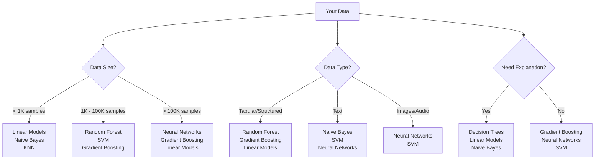

# Complete Beginner's Guide to Machine Learning Model Selection


Welcome to machine learning! This guide will help you understand **what models exist**, **when to use them**, and **how to choose the right one** for your problem. No prior experience needed!

## 📋 Table of Contents

1. [Problem Types](#-first-things-first-what-type-of-problem-do-you-have)
2. [Classification Models](#-classification-models-predicting-categories)
   - [Logistic Regression](#1-logistic-regression-)
   - [Decision Trees](#2-decision-trees-)
   - [Random Forest](#3-random-forest-)
   - [Support Vector Machines](#4-support-vector-machines-svm-)
   - [K-Nearest Neighbors](#5-k-nearest-neighbors-knn-)
   - [Gradient Boosting](#6-gradient-boosting-xgboost-lightgbm-)
   - [Naive Bayes](#7-naive-bayes-)
   - [Neural Networks](#8-neural-networks-)
3. [Regression Models](#-regression-models-predicting-numbers)
4. [Unsupervised Learning](#-unsupervised-learning-models)
5. [Decision Framework](#-how-to-choose-the-decision-framework)
6. [Getting Started Recipe](#-practical-getting-started-recipe)
7. [Quick Reference](#-quick-reference-cheat-sheet)
8. [Model Performance Comparison](#-model-performance-comparison)
9. [Next Steps](#-next-steps)
10. [Resources](#-helpful-resources)

---

## 📊 Model Performance Comparison

Here's a practical comparison of different models on common datasets to help you understand their relative performance:

### Classification Performance (Accuracy %)

```python
import matplotlib.pyplot as plt
import numpy as np

# Typical performance ranges on different dataset types
models = ['Logistic\nRegression', 'Decision\nTree', 'Random\nForest', 
          'SVM', 'KNN', 'Gradient\nBoosting', 'Naive\nBayes', 'Neural\nNetwork']

# Performance on different data types (approximate ranges)
small_tabular = [85, 78, 82, 87, 83, 88, 80, 82]  # < 1K samples
medium_tabular = [87, 80, 89, 88, 85, 92, 82, 89]  # 1K-100K samples
text_data = [88, 75, 85, 90, 78, 87, 92, 91]      # Text classification
image_data = [65, 70, 75, 78, 72, 80, 60, 95]     # Image classification

x = np.arange(len(models))
width = 0.2

fig, ax = plt.subplots(figsize=(14, 8))
bars1 = ax.bar(x - 1.5*width, small_tabular, width, label='Small Tabular Data', alpha=0.8)
bars2 = ax.bar(x - 0.5*width, medium_tabular, width, label='Medium Tabular Data', alpha=0.8)
bars3 = ax.bar(x + 0.5*width, text_data, width, label='Text Data', alpha=0.8)
bars4 = ax.bar(x + 1.5*width, image_data, width, label='Image Data', alpha=0.8)

ax.set_xlabel('Machine Learning Models')
ax.set_ylabel('Accuracy (%)')
ax.set_title('Model Performance Comparison Across Different Data Types')
ax.set_xticks(x)
ax.set_xticklabels(models, rotation=45, ha='right')
ax.legend()
ax.grid(axis='y', alpha=0.3)

plt.tight_layout()
plt.show()
```

### Training Time vs Performance Trade-off

| Model | Training Speed | Prediction Speed | Typical Accuracy | Interpretability |
|-------|---------------|------------------|------------------|------------------|
| **Logistic Regression** | ⚡⚡⚡ Very Fast | ⚡⚡⚡ Very Fast | 🟡 Good | ⭐⭐⭐ High |
| **Decision Tree** | ⚡⚡⚡ Very Fast | ⚡⚡⚡ Very Fast | 🟡 Good | ⭐⭐⭐ High |
| **Random Forest** | ⚡⚡ Fast | ⚡⚡ Fast | 🟢 Very Good | ⭐⭐ Medium |
| **SVM** | ⚡ Slow | ⚡⚡ Fast | 🟢 Very Good | ⭐ Low |
| **KNN** | ⚡⚡⚡ Very Fast | 🔴 Very Slow | 🟡 Good | ⭐⭐ Medium |
| **Gradient Boosting** | 🔴 Very Slow | ⚡⚡ Fast | 🔵 Excellent | ⭐ Low |
| **Naive Bayes** | ⚡⚡⚡ Very Fast | ⚡⚡⚡ Very Fast | 🟡 Good | ⭐⭐⭐ High |
| **Neural Networks** | 🔴 Very Slow | ⚡⚡ Fast | 🔵 Excellent | ⭐ Very Low |

### When Each Model Shines ⭐



---

## 🎯 First Things First: What Type of Problem Do You Have?

Before choosing a model, identify your problem type:

### **Supervised Learning** (You have input-output pairs)
- **Classification**: Predicting categories (spam/not spam, cat/dog/bird)
- **Regression**: Predicting numbers (house prices, temperature, sales)

### **Unsupervised Learning** (You only have inputs, no target outputs)
- **Clustering**: Grouping similar data points
- **Dimensionality Reduction**: Simplifying complex data
- **Anomaly Detection**: Finding unusual patterns

---

## 📊 Classification Models (Predicting Categories)

### 1. **Logistic Regression** 🎯
**What it is:** A simple linear method that draws straight lines to separate categories.

**When to use:**
- Your first choice for binary classification (yes/no, spam/not spam)
- You have relatively few features (< 1000)
- You want to understand which features matter most
- You need fast predictions

**Example problems:**
- Email spam detection
- Medical diagnosis (disease/no disease)
- Customer will buy/won't buy

```python
from sklearn.linear_model import LogisticRegression
from sklearn.model_selection import train_test_split
from sklearn.metrics import accuracy_score

# Simple example
model = LogisticRegression()
X_train, X_test, y_train, y_test = train_test_split(X, y, test_size=0.2)
model.fit(X_train, y_train)
predictions = model.predict(X_test)
print(f"Accuracy: {accuracy_score(y_test, predictions):.2f}")
```

**Pros:** Fast, interpretable, works well with small datasets
**Cons:** Can't handle complex relationships between features

---

### 2. **Decision Trees** 🌳
**What it is:** Creates a tree of if-then questions to make decisions.

**When to use:**
- You want a model you can easily explain to others
- Your data has mixed types (numbers and categories)
- You don't mind some overfitting initially

**Example problems:**
- Loan approval (if income > $50K and credit_score > 700, then approve)
- Medical diagnosis with clear decision rules
- Marketing campaign targeting

```python
from sklearn.tree import DecisionTreeClassifier
from sklearn.tree import plot_tree
import matplotlib.pyplot as plt

# Simple example
model = DecisionTreeClassifier(max_depth=3, random_state=42)
model.fit(X_train, y_train)

# Visualize the tree (optional)
plt.figure(figsize=(12, 8))
plot_tree(model, feature_names=['feature1', 'feature2'], filled=True)
plt.show()
```

**Pros:** Very interpretable, handles mixed data types
**Cons:** Can overfit easily, unstable (small data changes = different tree)

---

### 3. **Random Forest** 🌲🌲🌲
**What it is:** Combines many decision trees and takes their majority vote.

**When to use:**
- You want good performance without much tuning
- You have tabular data (spreadsheet-like)
- You want some interpretability but better performance than single trees
- Medium-sized datasets (1K - 100K rows)

**Example problems:**
- Customer churn prediction
- Feature importance analysis
- Fraud detection

```python
from sklearn.ensemble import RandomForestClassifier
from sklearn.model_selection import cross_val_score
import numpy as np

# Simple example with cross-validation
model = RandomForestClassifier(n_estimators=100, random_state=42)
scores = cross_val_score(model, X, y, cv=5)
print(f"Average accuracy: {np.mean(scores):.3f} (+/- {np.std(scores)*2:.3f})")

# Feature importance
model.fit(X_train, y_train)
importances = model.feature_importances_
print("Feature importances:", importances)
```

**Pros:** Usually works well out-of-the-box, handles missing values, shows feature importance
**Cons:** Less interpretable than single trees, can overfit with very noisy data

---

### 4. **Support Vector Machines (SVM)** ⚡
**What it is:** Finds the best boundary between categories by maximizing the margin.

**When to use:**
- You have high-dimensional data (many features)
- Small to medium datasets
- Text classification problems
- You want robust performance

**Example problems:**
- Text classification (sentiment analysis)
- Image classification (when you have limited data)
- Bioinformatics problems

```python
from sklearn.svm import SVC
from sklearn.preprocessing import StandardScaler
from sklearn.pipeline import Pipeline

# SVM with preprocessing pipeline
pipeline = Pipeline([
    ('scaler', StandardScaler()),  # SVM needs scaled features
    ('svm', SVC(kernel='rbf', random_state=42))
])

pipeline.fit(X_train, y_train)
accuracy = pipeline.score(X_test, y_test)
print(f"SVM accuracy: {accuracy:.3f}")
```

**Pros:** Works well with high dimensions, memory efficient
**Cons:** Slow on large datasets, hard to interpret, sensitive to feature scaling

---

### 5. **K-Nearest Neighbors (KNN)** 👥
**What it is:** Classifies based on what the K nearest neighbors are labeled as.

**When to use:**
- You have a small dataset
- Local patterns matter (similar things should have similar labels)
- You want a simple, intuitive method
- Non-linear decision boundaries

**Example problems:**
- Recommendation systems
- Pattern recognition
- Small-scale image classification

```python
from sklearn.neighbors import KNeighborsClassifier
from sklearn.preprocessing import StandardScaler

# KNN example
scaler = StandardScaler()
X_train_scaled = scaler.fit_transform(X_train)
X_test_scaled = scaler.transform(X_test)

model = KNeighborsClassifier(n_neighbors=5)
model.fit(X_train_scaled, y_train)
accuracy = model.score(X_test_scaled, y_test)
print(f"KNN accuracy: {accuracy:.3f}")
```

**Pros:** Simple to understand, no training time, works with non-linear patterns
**Cons:** Slow predictions, sensitive to irrelevant features, needs feature scaling

---

### 6. **Gradient Boosting (XGBoost, LightGBM)** 🚀
**What it is:** Builds models sequentially, each one correcting the mistakes of previous ones.

**When to use:**
- You want the best possible performance on tabular data
- You're willing to spend time tuning hyperparameters
- You have structured/tabular data
- Kaggle competitions!

**Example problems:**
- Winning data science competitions
- Financial risk modeling
- Advanced fraud detection
- Sales forecasting

```python
# Using XGBoost (install with: pip install xgboost)
import xgboost as xgb
from sklearn.model_selection import GridSearchCV

# XGBoost example
model = xgb.XGBClassifier(random_state=42)

# Hyperparameter tuning
param_grid = {
    'n_estimators': [100, 200],
    'max_depth': [3, 5, 7],
    'learning_rate': [0.1, 0.01]
}

grid_search = GridSearchCV(model, param_grid, cv=3, scoring='accuracy')
grid_search.fit(X_train, y_train)
print(f"Best parameters: {grid_search.best_params_}")
print(f"Best score: {grid_search.best_score_:.3f}")
```

**Pros:** Often gives the best performance on structured data
**Cons:** Easy to overfit, requires careful tuning, less interpretable

---

### 7. **Naive Bayes** 📝
**What it is:** Uses probability and assumes features are independent of each other.

**When to use:**
- Text classification problems
- Small datasets
- You need very fast training and prediction
- Features are somewhat independent

**Example problems:**
- Spam email detection
- Sentiment analysis
- Document classification
- Medical diagnosis with independent symptoms

```python
from sklearn.naive_bayes import GaussianNB, MultinomialNB
from sklearn.feature_extraction.text import CountVectorizer

# For numerical features
model = GaussianNB()
model.fit(X_train, y_train)
accuracy = model.score(X_test, y_test)
print(f"Naive Bayes accuracy: {accuracy:.3f}")

# For text classification
vectorizer = CountVectorizer()
X_train_text = vectorizer.fit_transform(text_train)
X_test_text = vectorizer.transform(text_test)

text_model = MultinomialNB()
text_model.fit(X_train_text, y_train)
text_accuracy = text_model.score(X_test_text, y_test)
print(f"Text classification accuracy: {text_accuracy:.3f}")
```

**Pros:** Very fast, works well with small data, handles multiple classes naturally
**Cons:** Strong independence assumption, can be outperformed by other methods

---

### 8. **Neural Networks** 🧠
**What it is:** Inspired by brain neurons, learns complex patterns through layers.

**When to use:**
- You have lots of data (10K+ samples)
- Complex patterns in images, text, or audio
- You need to capture non-linear relationships
- You have computational resources

**Example problems:**
- Image recognition
- Natural language processing
- Speech recognition
- Complex pattern recognition

```python
from sklearn.neural_network import MLPClassifier
from sklearn.preprocessing import StandardScaler

# Simple neural network example
scaler = StandardScaler()
X_train_scaled = scaler.fit_transform(X_train)
X_test_scaled = scaler.transform(X_test)

model = MLPClassifier(
    hidden_layer_sizes=(100, 50),  # Two hidden layers
    max_iter=1000,
    random_state=42
)

model.fit(X_train_scaled, y_train)
accuracy = model.score(X_test_scaled, y_test)
print(f"Neural Network accuracy: {accuracy:.3f}")
```

**Pros:** Can learn very complex patterns, versatile
**Cons:** Needs lots of data, computationally expensive, hard to interpret

---

## 📈 Regression Models (Predicting Numbers)

### 1. **Linear Regression** 📏
**What it is:** Fits a straight line through your data points.

**When to use:**
- Your first choice for any regression problem
- Linear relationship between features and target
- You need to understand feature importance
- Small to medium datasets

**Example problems:**
- House price prediction
- Sales forecasting
- Temperature prediction

```python
from sklearn.linear_model import LinearRegression
from sklearn.metrics import mean_squared_error, r2_score
import numpy as np

# Linear regression example
model = LinearRegression()
model.fit(X_train, y_train)
predictions = model.predict(X_test)

# Evaluation metrics
mse = mean_squared_error(y_test, predictions)
rmse = np.sqrt(mse)
r2 = r2_score(y_test, predictions)

print(f"RMSE: {rmse:.2f}")
print(f"R² Score: {r2:.3f}")
print(f"Feature coefficients: {model.coef_}")
```

**Pros:** Simple, fast, interpretable, good baseline
**Cons:** Only captures linear relationships

---

### 2. **Polynomial Regression** 📈
**What it is:** Like linear regression but can fit curves by using squared, cubed, etc. features.

**When to use:**
- You see curved relationships in your data
- Linear regression isn't capturing the pattern
- You still want some interpretability

**Example problems:**
- Population growth modeling
- Economics (diminishing returns)
- Physical phenomena with curved relationships

```python
from sklearn.preprocessing import PolynomialFeatures
from sklearn.linear_model import LinearRegression
from sklearn.pipeline import Pipeline

# Polynomial regression example
poly_model = Pipeline([
    ('poly', PolynomialFeatures(degree=2)),
    ('linear', LinearRegression())
])

poly_model.fit(X_train, y_train)
predictions = poly_model.predict(X_test)
r2 = r2_score(y_test, predictions)
print(f"Polynomial Regression R² Score: {r2:.3f}")
```

**Pros:** Can capture non-linear patterns, still relatively interpretable
**Cons:** Can overfit easily, gets complex with many features

---

### 3. **Decision Tree/Random Forest Regression** 🌳
**When to use:** Same as classification versions, but for predicting numbers
- Mixed data types
- Non-linear relationships
- Want interpretability (Decision Tree) or performance (Random Forest)

---

### 4. **Support Vector Regression (SVR)** ⚡
**When to use:** Same as SVM classification, but for numbers
- High-dimensional data
- Robust predictions needed
- Non-linear relationships (with kernel trick)

---

## 🎯 Unsupervised Learning Models

### 1. **K-Means Clustering** 🎪
**What it is:** Groups data points into K clusters based on similarity.

**When to use:**
- You want to find natural groups in your data
- Customer segmentation
- You know roughly how many groups to expect

**Example problems:**
- Market segmentation
- Organizing large datasets
- Image segmentation

```python
from sklearn.cluster import KMeans
import matplotlib.pyplot as plt

# K-Means clustering example
model = KMeans(n_clusters=3, random_state=42)
clusters = model.fit_predict(X)

# Evaluate clustering (if you have true labels)
from sklearn.metrics import adjusted_rand_score
if 'true_labels' in locals():
    ari_score = adjusted_rand_score(true_labels, clusters)
    print(f"Adjusted Rand Index: {ari_score:.3f}")

# Visualize clusters (for 2D data)
plt.figure(figsize=(8, 6))
plt.scatter(X[:, 0], X[:, 1], c=clusters, cmap='viridis')
plt.scatter(model.cluster_centers_[:, 0], model.cluster_centers_[:, 1], 
           c='red', marker='x', s=200, linewidths=3)
plt.title('K-Means Clustering Results')
plt.show()
```

**Pros:** Simple, fast, works well with spherical clusters
**Cons:** Need to specify number of clusters, struggles with different cluster sizes

---

### 2. **Hierarchical Clustering** 🌳
**What it is:** Creates a tree of clusters, from individual points to one big cluster.

**When to use:**
- You don't know how many clusters you need
- You want to see the hierarchy of groupings
- Smaller datasets (computationally expensive)

**Example problems:**
- Phylogenetic trees (evolution)
- Social network analysis
- Product categorization

```python
from sklearn.cluster import AgglomerativeClustering
from scipy.cluster.hierarchy import dendrogram, linkage
import matplotlib.pyplot as plt

# Hierarchical clustering example
model = AgglomerativeClustering(n_clusters=3)
clusters = model.fit_predict(X)

# Create dendrogram
linkage_matrix = linkage(X, method='ward')
plt.figure(figsize=(10, 7))
dendrogram(linkage_matrix)
plt.title('Hierarchical Clustering Dendrogram')
plt.xlabel('Sample Index')
plt.ylabel('Distance')
plt.show()
```

**Pros:** Don't need to specify cluster count, creates interpretable hierarchy
**Cons:** Computationally expensive, sensitive to noise

---

### 3. **Principal Component Analysis (PCA)** 📊
**What it is:** Reduces the number of features while keeping the most important information.

**When to use:**
- You have too many features (curse of dimensionality)
- Data visualization (reduce to 2D or 3D)
- Preprocessing before other algorithms
- Noise reduction

**Example problems:**
- Visualizing high-dimensional data
- Preprocessing for machine learning
- Image compression
- Exploratory data analysis

```python
from sklearn.decomposition import PCA
import matplotlib.pyplot as plt
import numpy as np

# PCA example
pca = PCA(n_components=2)  # Reduce to 2 dimensions
X_reduced = pca.fit_transform(X)

# Print explained variance ratio
print("Explained variance ratio:", pca.explained_variance_ratio_)
print("Total variance explained:", np.sum(pca.explained_variance_ratio_))

# Visualize reduced data
plt.figure(figsize=(8, 6))
plt.scatter(X_reduced[:, 0], X_reduced[:, 1])
plt.xlabel('First Principal Component')
plt.ylabel('Second Principal Component')
plt.title('PCA Visualization')
plt.show()
```

**Pros:** Reduces computational cost, removes noise, enables visualization
**Cons:** Features become harder to interpret, some information is lost

---

### Practical Model Comparison Example

Here's a complete example showing how to compare multiple models on the same dataset:

```python
import numpy as np
import matplotlib.pyplot as plt
from sklearn.datasets import make_classification
from sklearn.model_selection import cross_val_score, train_test_split
from sklearn.linear_model import LogisticRegression
from sklearn.tree import DecisionTreeClassifier
from sklearn.ensemble import RandomForestClassifier
from sklearn.svm import SVC
from sklearn.neighbors import KNeighborsClassifier
from sklearn.naive_bayes import GaussianNB
from sklearn.preprocessing import StandardScaler
from sklearn.metrics import classification_report

# Create sample dataset
X, y = make_classification(n_samples=1000, n_features=20, n_informative=10, 
                          n_redundant=10, n_clusters_per_class=1, random_state=42)

# Split the data
X_train, X_test, y_train, y_test = train_test_split(X, y, test_size=0.2, random_state=42)

# Scale features for models that need it
scaler = StandardScaler()
X_train_scaled = scaler.fit_transform(X_train)
X_test_scaled = scaler.transform(X_test)

# Define models to compare
models = {
    'Logistic Regression': LogisticRegression(random_state=42),
    'Decision Tree': DecisionTreeClassifier(random_state=42),
    'Random Forest': RandomForestClassifier(random_state=42, n_estimators=100),
    'SVM': SVC(random_state=42),
    'KNN': KNeighborsClassifier(n_neighbors=5),
    'Naive Bayes': GaussianNB()
}

# Compare models using cross-validation
results = []
names = []

print("Model Comparison (5-Fold Cross Validation):")
print("-" * 50)

for name, model in models.items():
    # Use scaled data for SVM and KNN
    if name in ['SVM', 'KNN']:
        cv_results = cross_val_score(model, X_train_scaled, y_train, cv=5, scoring='accuracy')
    else:
        cv_results = cross_val_score(model, X_train, y_train, cv=5, scoring='accuracy')
    
    results.append(cv_results)
    names.append(name)
    
    print(f"{name:20}: {cv_results.mean():.3f} (+/- {cv_results.std() * 2:.3f})")

# Visualize results
plt.figure(figsize=(12, 8))
plt.boxplot(results, labels=names)
plt.title('Model Performance Comparison')
plt.ylabel('Accuracy Score')
plt.xticks(rotation=45, ha='right')
plt.grid(axis='y', alpha=0.3)
plt.tight_layout()
plt.show()

# Train best model and show detailed results
best_model_idx = np.argmax([r.mean() for r in results])
best_model_name = names[best_model_idx]
best_model = models[best_model_name]

print(f"\nBest performing model: {best_model_name}")
print(f"Cross-validation accuracy: {results[best_model_idx].mean():.3f}")

# Train and evaluate on test set
if best_model_name in ['SVM', 'KNN']:
    best_model.fit(X_train_scaled, y_train)
    y_pred = best_model.predict(X_test_scaled)
else:
    best_model.fit(X_train, y_train)
    y_pred = best_model.predict(X_test)

print(f"\nDetailed Results for {best_model_name}:")
print(classification_report(y_test, y_pred))
```

---

## 🤔 How to Choose: The Decision Framework same dataset
2. **Visualize performance differences** with box plots
3. **Select the best model** automatically
4. **Get detailed performance metrics**

### Step 1: Problem Type
- **Predicting categories** → Classification models
- **Predicting numbers** → Regression models  
- **Finding patterns without targets** → Unsupervised learning

### Step 2: Dataset Size
- **Small (< 1K samples):** Linear models, Naive Bayes, KNN
- **Medium (1K - 100K):** Random Forest, SVM, Gradient Boosting
- **Large (> 100K):** Neural Networks, Gradient Boosting, Linear models

### Step 3: Interpretability Needs
- **Need to explain decisions:** Linear models, Decision Trees, Naive Bayes
- **Black box is OK:** Neural Networks, Gradient Boosting, SVM with kernel

### Step 4: Data Type
- **Tabular/structured data:** Random Forest, Gradient Boosting, Linear models
- **Text data:** Naive Bayes, SVM, Neural Networks
- **Images:** Neural Networks (CNN), SVM
- **Time series:** LSTM Neural Networks, ARIMA, Linear models

### Step 5: Performance vs. Speed
- **Need fast training:** Linear models, Naive Bayes
- **Need fast predictions:** Linear models, KNN (if small data)
- **Want best performance:** Gradient Boosting, Neural Networks

---

## 🛠️ Practical Getting Started Recipe

### For Beginners - The "Always Start Here" Approach:

1. **Classification problems:** Start with Logistic Regression
2. **Regression problems:** Start with Linear Regression  
3. **If performance isn't good enough:** Try Random Forest
4. **If you need better performance:** Try Gradient Boosting (XGBoost)
5. **If you have images/text/audio:** Consider Neural Networks

### The Golden Rule: 
**Start simple, then get complex!** Always try simple models first - they often work surprisingly well and help you understand your data better.

---

## 📚 Quick Reference Cheat Sheet

| Problem Type | Small Data | Medium Data | Large Data | Need Interpretability |
|-------------|------------|-------------|------------|---------------------|
| **Classification** | Logistic Regression, Naive Bayes | Random Forest, SVM | XGBoost, Neural Networks | Decision Tree, Logistic Regression |
| **Regression** | Linear Regression | Random Forest | XGBoost, Neural Networks | Linear Regression, Decision Tree |
| **Clustering** | K-Means | K-Means, Hierarchical | K-Means | Hierarchical Clustering |
| **Text Data** | Naive Bayes | SVM | Neural Networks | Naive Bayes |
| **Image Data** | KNN, SVM | SVM | Neural Networks (CNN) | Decision Tree (on features) |

---

## 🎯 Next Steps

1. **Pick a simple dataset** (like Titanic, Boston Housing, or Iris)
2. **Start with the simplest appropriate model** from this guide
3. **Measure performance** using cross-validation
4. **Try 2-3 different model types** and compare
5. **Tune the best performing model**
6. **Gradually work with more complex datasets**

Remember: The best model is the one that solves your specific problem well, not necessarily the most complex one!

---

## 🔗 Helpful Resources

### 📚 Learning Platforms
- **[Kaggle Learn](https://www.kaggle.com/learn)** - Free micro-courses on ML fundamentals
- **[Coursera ML Course](https://www.coursera.org/learn/machine-learning)** - Andrew Ng's famous course
- **[Fast.ai](https://www.fast.ai/)** - Practical deep learning course

### 📖 Books for Beginners
- **"Hands-On Machine Learning"** by Aurélien Géron - Best practical guide
- **"Python Machine Learning"** by Sebastian Raschka - Great for Python users
- **"The Elements of Statistical Learning"** - More mathematical (advanced)

### 💻 Practice Datasets
- **[Kaggle Datasets](https://www.kaggle.com/datasets)** - Real-world datasets
- **[UCI ML Repository](https://archive.ics.uci.edu/ml/)** - Classic datasets
- **[Google Dataset Search](https://datasetsearch.research.google.com/)** - Find any dataset
- **Built-in sklearn datasets** - Perfect for learning

### 🛠️ Tools & Libraries
```python
# Essential Python libraries for ML
pip install scikit-learn pandas numpy matplotlib seaborn
pip install xgboost lightgbm  # For gradient boosting
pip install jupyter notebook  # For interactive coding
```

### 📊 Visualization Tools
- **matplotlib & seaborn** - Python plotting
- **plotly** - Interactive plots
- **tableau** - Professional dashboards (free version available)

### 🏆 Practice Competitions
- **Kaggle Competitions** - Real ML challenges
- **DrivenData** - Social impact competitions  
- **Analytics Vidhya** - Learning-focused competitions

### 📱 Mobile Apps for Learning
- **SoloLearn** - Learn Python basics
- **Datacamp** - Interactive data science lessons

Remember: **The best way to learn is by doing!** Start with simple projects and gradually work your way up to more complex ones.

Happy modeling! 🚀

---

## 📄 License

This guide is released under the MIT License. Feel free to use, modify, and share!

## 🤝 Contributing

Found an error or want to add something? PRs are welcome! Please:
1. Fork the repository
2. Create a feature branch
3. Make your changes
4. Submit a pull request

## ⭐ Star This Repo

If this guide helped you, please give it a star! It helps others discover this resource.

---

*Last updated: 2024 | Created with ❤️ for the ML community*
